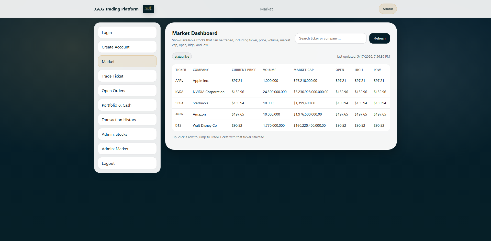
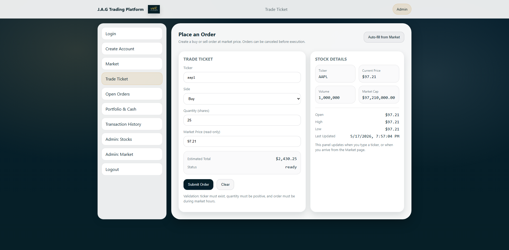
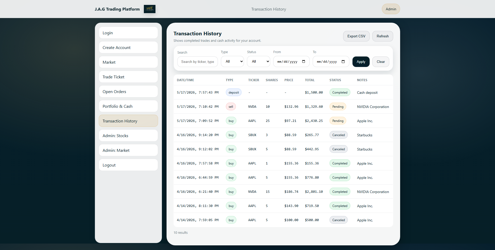
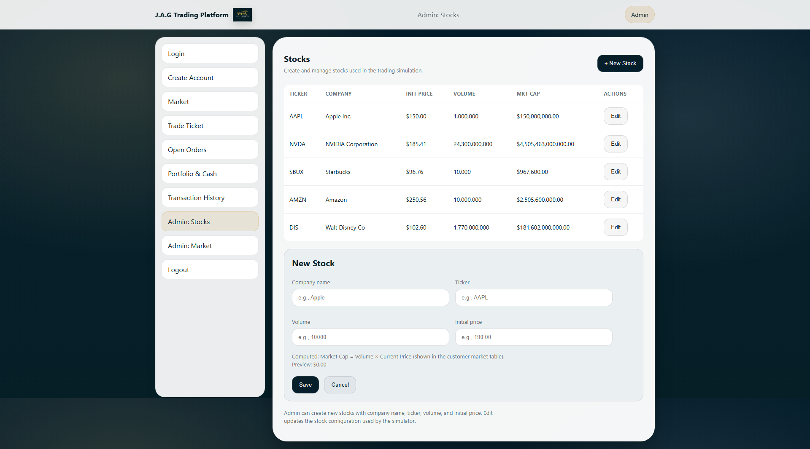
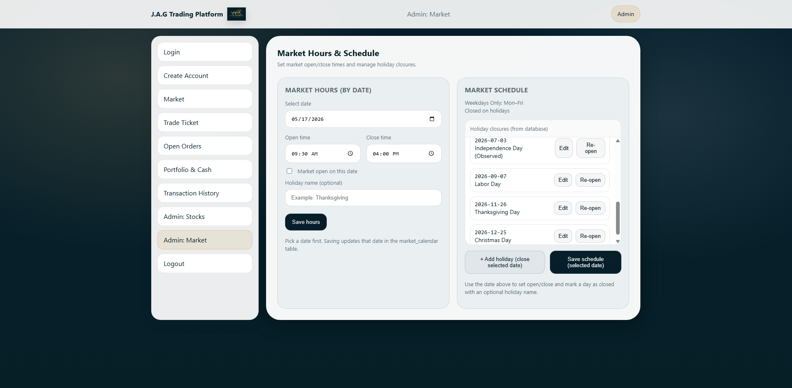

# JAG Trading Platform

Simulated stock trading platform built as a three-person capstone. I owned the backend and infrastructure: 15 Flask API endpoints, a cron-driven price engine, and both server environments.

**Live site:** [jagtrading.xyz](https://jagtrading.xyz) &nbsp;·&nbsp; **Status:** Complete

---

## Screenshots

<table>
  <tr>
    <td></td>
    <td></td>
  </tr>
  <tr>
    <td align="center"><em>Every price on this page comes from the cron job. It runs every 5 minutes during market hours and writes to two tables — the open/high/low columns depend on it.</em></td>
    <td align="center"><em>The Stock Details panel on the right populates the moment you enter a ticker — a live call to the backend. Orders are blocked outside market hours.</em></td>
  </tr>
  <tr>
    <td></td>
    <td></td>
  </tr>
  <tr>
    <td align="center"><em>Full trade log with search and filters. CSV export for downloading transaction history.</em></td>
    <td align="center"><em>Admin-only pages. The sidebar hides these tabs for regular users, and navigating directly triggers a redirect. The API endpoints enforce the role check on every request.</em></td>
  </tr>
  <tr>
    <td colspan="2"></td>
  </tr>
  <tr>
    <td colspan="2" align="center"><em>Admins set open/close times and mark holidays here.</em></td>
  </tr>
</table>

---

## Infrastructure

Two environments running the same stack — Apache, mod_wsgi, Flask, MySQL. Dev was an Ubuntu Server VM on my homelab server; production was an AWS EC2 t3.small. Both built up from a base OS image. HTTPS on production runs on a Let's Encrypt cert configured for auto-renewal.

The team got into the dev server through a Tailscale mesh VPN, which kept the dev box off the public internet entirely. Deployment was plain git: push to GitHub from dev, pull on production, restart Apache. Database moves between environments were handled with mysqldump. Project backups ran on cron with a 7-day rolling retention, and frequency increased as the codebase grew.

---

## The API — 15 Endpoints

| Category | Endpoints |
|----------|-----------|
| Auth | Login, logout, register, role check |
| Trading | Place order, cancel order |
| Market | List prices, get stock details |
| Portfolio | Holdings, cash balance, deposit, withdraw |
| Admin | Add stock, edit stock, set market hours |

All endpoints share a single `db_connection.py` module. The admin endpoints re-check the session role server-side before processing any request — they don't trust the UI.

All endpoints were validated against the live production deployment as part of the capstone demo.

---

## Price Engine

The prices on the Market Dashboard aren't pulled from a real market feed. They come from a Python script that runs on cron every 5 minutes during NYSE market hours. Each run pulls every stock from the database, nudges the price up or down by a random percent between 0.01% and 1.50%, and writes the new value to two tables — `stock` for the current price, and `price_history` for the open/high/low math on the dashboard. A $0.01 floor keeps prices from going negative.

Three cron entries cover the trading window:

```
30-59/5 9  * * 1-5  python3 /srv/group-project/backend/api/price_change.py
*/5    10-15 * * 1-5  python3 /srv/group-project/backend/api/price_change.py
59     15 * * 1-5  python3 /srv/group-project/backend/api/price_change.py
```

The script also runs its own market-hours check internally as a backup against cron misfires.

---

## Access Control

Three roles — Guest, User, Admin. Role lives in the session on the backend. The frontend calls a role check endpoint to decide what to render, but the actual enforcement happens server-side: every admin endpoint validates the session role before doing anything.

| Role | Access |
|------|--------|
| **Guest** | Market view only |
| **User** | Trading, portfolio, order history |
| **Admin** | Everything above + Admin: Stocks + Admin: Market |

Admins land on the Admin: Stocks page on login. The pill in the header reflects the current session role.

---

## Tech Stack

Python · Flask · MySQL · Apache · mod_wsgi · Ubuntu Server · AWS EC2 · Tailscale · Bash · Git

---

## Additional Pages

Pages not covered in the screenshots above:

- **Login** — credentials check; admins are routed straight to Admin: Stocks, everyone else lands on Portfolio & Cash
- **Create Account** — user registration, passwords hashed with werkzeug
- **Open Orders** — pending order queue with cancel controls
- **Portfolio & Cash** — balances, holdings table, deposit/withdraw
